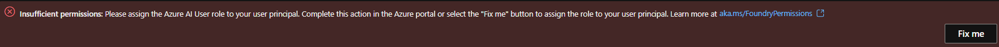

# azure_ai_agent_workshop

Hands on workshop to build a generative AI agent using Azure AI Foundry and Azure OpenAI service.

# Pre-requisite

1. Environment Set up: 

Follow below steps to set up Azure AI Foundry Project environment 

* Use the **Basic Agent Setup** template provided in the Microsoft Learn documentation (link below).

    *Note: Prefer regions such as Sweden Central for deployment. Avoid using East US (EUS) or East US 2 (EUS2), as these regions may experience resource availability constraints.!*

    https://learn.microsoft.com/en-us/azure/ai-services/agents/environment-setup#deployment-options 

* Open the newly created project using Azure AI Foundry portal.

* You should see below error message on the top - 

    

    Click on "Fix me" to assign Azure AI User role to your user principal. 

* Go to *'Models + endpoint'* - and confirm *gpt-4o* model is already deployed.

* Deploy new "text-embedding-ada-002" model

* Create new Azure AI Search Index on your own data. If you don't have any AI Search index created prior to this workshop, please create new AI Search Index.

    * You can use perks plus PDF document provided in */data* folder of this repo.

    * Suggestion: use AI search Integrated vectorization option and enable semantic search.

    * Make sure you use *text-embedding-ada-002* model for embeddings.

    * Please refer AI Foundry workshop instruction if needed:  *[nileshvj2/AzureAIFoundry_Workshop/Day-1/1.3.2-Integrated Vector Indexing.md](https://github.com/nileshvj2/AzureAIFoundry_Workshop/blob/main/Day-1/1.3.2-Integrated%20Vector%20Indexing.md)*

* Go to *'Connected resources'* of your project and add new connection to Azure AI search Index.

    You can use key based on Entra ID authentication options.

    In case if you are using Entra-ID based authentication, please make sure you have right permissions set up.  

    Please refer AI Foundry workshop instruction if needed:  *[nileshvj2/AzureAIFoundry_Workshop/Day-1/1.1-Project Set Up.md](https://github.com/nileshvj2/AzureAIFoundry_Workshop/blob/main/Day-1/1.1-Project%20Set%20Up.md)*

* At the end of this step, ensure that the connection to the AI Search index is successfully established and displayed in project connection list.

2. You have github account created and familiar with github interface/commands.

3. Familarity with Python and Jupyter notebooks is a plus but not required.

# Instructions 

* Fork this repo using your github account.
* You can run the notebook in your local environment or using github codespaces. (python 3.10 or above is required)
* Follow instructions in the notebook to complete workshop.

# Disclaimer

The information and code contained in this repo and any accompanying materials (including, but not limited to, scripts, sample codes, etc.) are provided “AS-IS” and “WITH ALL FAULTS.” by owner and contributors of the repo.

Code and information in this repo is provided solely for demonstration purposes and does not represent Microsoft or any other company's official documentation. Author assumes no liability arising from your use of this material.